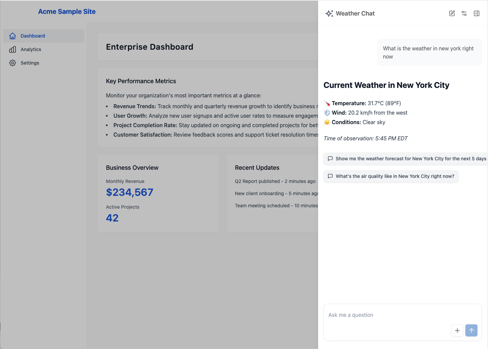
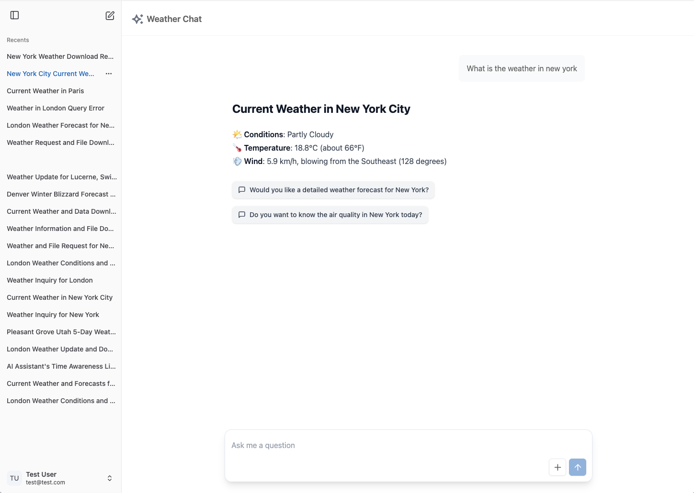

# Pika (ピカ)

A framework for rapidly deploying AI-powered chat applications and agents. The name "Pika" (ピカ) in Japanese means "spark" or "flash of electricity," symbolizing its purpose of quickly igniting and powering new agent-based solutions.


## 📚 Documentation

Pika Framework documentation is organized into two main categories:

### 🎯 **Conceptual Documentation** (`/docs/concepts/`)

Understand the **why** and **what** of Pika Framework:

- [Nothing New Under the Sun](./docs/concepts/1.nothing-new-under-the-sun.md) - The evolution of software orchestration
- [Agents Flip the Paradigm](./docs/concepts/2.agents-flip-the-paradigm.md) - How agents change software development
- [Agent Basics](./docs/concepts/3.agent-basics.md) - Core components of AI agents
- [Building Agent Infrastructure](./docs/concepts/4.agents-pika.md) - How Pika enables agent development
- [TonicX Integration Testing](./docs/concepts/5.tonicx.md) - AI-powered testing with Pika

### 🛠️ **Developer Documentation** (`/docs/developer/`)

Learn the **how** - practical guides for building with Pika:

- [Getting Started](./docs/developer/getting-started.md) - Quick start guide
- [Installation Guide](./docs/developer/installation.md) - Detailed setup instructions
- [Project Structure](./docs/developer/project-structure.md) - Understanding your Pika project
- [Stack Management](./docs/developer/stack-management.md) - Best practices for managing chat app stacks
- [Customization Guide](./docs/developer/customization.md) - How to customize Pika
- [Authentication Setup](./docs/developer/authentication.md) - Setting up authentication
- [Local Development](./docs/developer/local-development.md) - Running Pika locally
- [AWS Deployment](./docs/developer/aws-deployment.md) - Deploying to AWS
- [Sync System](./docs/developer/sync-system.md) - Managing framework updates
- [Troubleshooting](./docs/developer/troubleshooting.md) - Common issues and solutions

### 📖 **Documentation Overview**

Start with the [Documentation Overview](./docs/README.md) for a complete guide to navigating the docs.

## 🚀 Getting Started

### Quick Start

1. **Install Pika CLI**:

    ```bash
    pnpm install -g @pika/cli
    ```

2. **Create your first application**:

    ```bash
    pika create-app my-chat-app
    cd my-chat-app
    pnpm dev
    ```

3. **Access your application**:
    - Main chat interface: `http://localhost:3000`
    - Weather chat app: `http://localhost:3000/chat/weather`

### What You Get

When you create a Pika application, you receive:

- **Generic Chat Frontend** - Ready-to-use chat interface that works with any agent
- **Generic Chat Backend** - Core infrastructure for agent management and tool orchestration
- **Sample Weather Service** - Example of how to define a chat app/agent
- **Sample Web Application** - Demo of embedded chat mode
- **Authentication System** - Ready-to-customize authentication
- **Custom UI Components** - Support for custom markdown tag components
- **AWS CDK Integration** - Infrastructure as Code for easy deployment
- **Sync System** - Keep your customizations while receiving framework updates

### Next Steps

1. **Configure your project** - Update `pika-config.ts` with your project names
2. **Customize authentication** - Set up your authentication provider
3. **Add custom components** - Create custom UI components for your chat
4. **Deploy your services** - Deploy to AWS or run locally
5. **Create custom agents** - Build your own chat applications and agents

For detailed instructions, see the [Getting Started Guide](./docs/developer/getting-started.md).

## Overview

### The Bad Approach

You need to start making agents and chatbots to jump on the AI revolution bus. Here's what you don't want:

- Agents separated from the microservices that power them
- Every team creating a new chatbot web app
- Difficulty rolling out new agent infrastructure since agents are everywhere
- LLM access all over the place
- The number of new services and apps balloons


### The Pika Approach

- One generic frontend and backend chat app in the entire platform
- Microservices define their chat app and agent definitions as part of their infra
- You go to the pika chat app front end to hit any custom chat app in your platform


### Chat Apps Embed in your Existing Web Apps

The prime use case for agents and chat apps is to add AI to existing applications. The Pika Frontend is designed to be embedded in an existing webapp as an iframe.



### Chat Apps Can Stand Alone

Of course, you can also have a stand alone chat app. It's just config.



## Pika addresses a fundamental shift in software development:

- **Traditional Approach**: Engineers spend months building specific features with hardcoded orchestration logic
- **Agent Approach**: Using AI (specifically LLMs) as dynamic orchestration engines that can instantly materialize solutions based on user intent

## 🏗️ Architecture

The framework consists of three main layers:

### 1. Pika Generic Frontend

- Pre-built chat interface
- Handles user interactions and chat state
- Supports file uploads and rich media

### 2. Pika Backend

- Agent management infrastructure
- Tool orchestration
- Knowledge base integration
- AWS Bedrock integration

### 3. Custom Agent Stack

- Custom agent definitions
- Tool implementations
- Knowledge base connections
- Infrastructure as Code (AWS CDK)

## 🛠️ Technical Stack

- **Infrastructure**: AWS CDK for infrastructure as code
- **AI Platform**: AWS Bedrock for agent execution
- **Architecture**: Modular design supporting:
    - Custom agent definitions
    - Tool implementations
    - Knowledge base integrations
    - Infrastructure management

## 🚀 Deployment Model

Pika uses a simple two-stack deployment model that separates infrastructure from agent capabilities:

### Core Infrastructure Stacks

1. **Chat Frontend Stack**

    - Deploy once to get a generic chat interface
    - Provides a ready-to-use web application
    - Handles user authentication and session management
    - Accessible via a URL after deployment

2. **Chat Backend Stack**
    - Deploy once to get the core agent infrastructure
    - Manages agent execution and tool orchestration
    - Handles knowledge base integration
    - Provides the API layer for agent interactions

### Your Custom Stacks

After deploying the core infrastructure, you can create your own stacks to define:

- Custom agents with specific capabilities
- Tools that your agents can use
- Knowledge bases for your domain
- Additional infrastructure as needed

Example CDK stack for a custom agent:

```typescript
export class WeatherAgentStack extends cdk.Stack {
    constructor(scope: Construct, id: string, props: WeatherStackProps) {
        super(scope, id, props);

        // Define your agent and tools
        const agentData = {
            agentId: `weather-agent-${this.stage}`,
            basePrompt: weatherAgentInstruction,
            tools: [
                {
                    toolId: `weather-tool-${this.stage}`,
                    name: 'weather-tool',
                    description: 'Get weather information',
                    executionType: 'lambda',
                    functionSchema: weatherFunctions
                }
            ]
        };

        // Create the Lambda function for your tool
        const weatherLambda = new lambda.Function(this, 'WeatherFunction', {
            runtime: lambda.Runtime.NODEJS_18_X,
            handler: 'index.handler',
            code: lambda.Code.fromAsset('lambda'),
            environment: {
                WEATHER_API_KEY: 'your-api-key'
            }
        });

        // Register your agent with Pika
        new cdk.CustomResource(this, 'WeatherAgent', {
            serviceToken: props.customResourceArn,
            properties: {
                Stage: this.stage,
                AgentData: JSON.stringify(agentData),
                ToolIdToLambdaArnMap: {
                    [`weather-tool-${this.stage}`]: weatherLambda.functionArn
                },
                Timestamp: String(Date.now())
            }
        });
    }
}
```

### Defining Your Agent

Your agent needs two key components: function definitions and instructions. Here's a simplified example:

```typescript
// Define what your agent can do
const weatherFunctions = [
    {
        name: 'getWeatherForecast',
        description: 'Get weather forecast for a location',
        parameters: {
            latitude: {
                type: 'number',
                description: 'Location latitude',
                required: true
            },
            longitude: {
                type: 'number',
                description: 'Location longitude',
                required: true
            },
            startDate: {
                type: 'string',
                description: 'Start date (ISO format)',
                required: false
            }
        }
    },
    {
        name: 'getCurrentWeather',
        description: 'Get current weather conditions',
        parameters: {
            latitude: {
                type: 'number',
                description: 'Location latitude',
                required: true
            },
            longitude: {
                type: 'number',
                description: 'Location longitude',
                required: true
            }
        }
    }
];

// Define how your agent should behave
const weatherAgentInstruction = `
You are WeatherInsightAgent, a weather data assistant.

Core Directives:
1. Provide accurate weather information
2. Make information easily understandable
3. Use charts and visualizations when helpful
4. Format responses in Markdown

Response Format:
- Wrap all responses in <answer></answer> tags
- Use <chart></chart> for visualizations
- Use <prompt></prompt> for follow-up suggestions
- Include timezone information when relevant

Example:
<answer>
## Current Weather in San Francisco
Temperature: 72°F
Humidity: 65%
<chart>{"type":"line","data":{"labels":["Now","1h","2h"],"datasets":[{"label":"Temperature","data":[72,70,68]}]}}</chart>
<prompt>Show me the forecast for tomorrow</prompt>
</answer>
`;
```

> **Note**: Agents can be built with different combinations of capabilities:
>
> - Tools (function definitions) for dynamic actions
> - Knowledge bases for domain-specific information
> - Or both! Mix and match based on your needs

### How It Works

1. Deploy the core Pika stacks once
2. Create your custom stacks using Pika's CDK constructs
3. Define your agents, tools, and knowledge bases
4. Access your agents through the generic frontend URL
5. Add new capabilities by deploying additional stacks

This separation of concerns allows you to:

- Focus on defining agent capabilities without infrastructure management
- Deploy new agents without touching the core infrastructure
- Scale your agent ecosystem independently
- Maintain different agents for different use cases
- Update agent capabilities without affecting the core system

## ✨ Key Features

### 1. Speed to Market

- Rapid deployment of chat applications
- Quick iteration on agent capabilities
- Fast updates to existing solutions

### 2. Flexibility

- One API set can serve infinite combinations of use cases
- Dynamic orchestration based on user intent
- Custom solutions materialized in real-time

### 3. User Empowerment

- Users express needs directly in natural language
- No need to learn specific interfaces
- Rich responses including text, charts, and interactive elements

## 💼 Business Impact

### Development Efficiency

- From months to seconds for new use cases
- Focus on creating reusable capabilities rather than specific features
- Lower maintenance overhead

### Customer Experience

- Custom solutions for every interaction
- Natural language interaction
- Rich, contextual responses

### Resource Optimization

- Shared infrastructure
- Reduced development costs
- Better resource utilization

## 🎯 Use Cases

- Customer Service automation
- Enterprise Documentation access
- Data Analysis and visualization
- Weather insights
- Business metrics and trend analysis

## 🔮 Future Vision

The framework continues to evolve with plans for:

- Enhanced tooling and debugging capabilities
- Improved knowledge base integration
- Advanced deployment options
- Better monitoring and cost optimization
- Enhanced security features

## 🤝 Contributing

[Coming soon]

## 📄 License

This project is licensed under the MIT License - see the [LICENSE](LICENSE) file for details.
