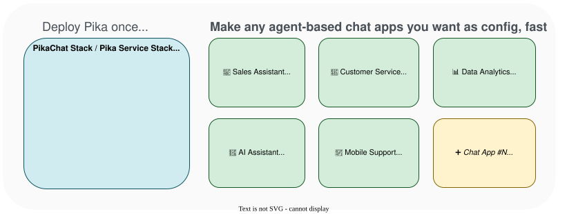

# Pika (ピカ) ⚡

> **A framework for rapidly deploying AI-powered chat applications and agents**

The name "Pika" (ピカ) in Japanese means "spark" or "flash of electricity," symbolizing its purpose of quickly igniting and powering new agent-based solutions.

## Documentation

**[Visit the complete documentation and guide website →](https://pika.tools)**

For detailed guides, tutorials, and API references, visit our dedicated documentation site.

## NPM Packages

Pika provides two main npm packages for different use cases:

### `pika-shared` - TypeScript Types Library

Shared TypeScript types and utilities for building Pika-compatible applications.

```bash
npm install pika-shared
```

### `pika-serverless` - Serverless Framework Plugin

A [Serverless Framework v3](https://www.serverless.com/) plugin that enables seamless integration of AI agents and chat applications with your existing serverless functions.

```bash
npm install --save-dev pika-serverless
```

**Perfect for:** Adding AI capabilities to existing serverless applications, teams using Serverless Framework, microservices architecture.

[View Serverless Plugin Documentation](./packages/pika-serverles/)

**Perfect for:** TypeScript projects, custom agent implementations, type-safe development.

## Quick Start

### Install the Full Pika Framework

```bash
# Install Pika CLI
pnpm install -g pika-app

# Create your first application
pika create-app my-chat-app
cd my-chat-app
pnpm dev
```

### Serverless Plugin (If you want to make agents in a serverless framework project)

```bash
# Add to existing Serverless Framework project
npm install --save-dev pika-serverless

# Add to serverless.yml
plugins:
  - pika-serverless
```

See our [examples](./packages/pika-serverles/examples/) for complete working implementations.

## What is Pika?

Pika solves the **agent proliferation problem** in organizations adopting AI:

** The Problem:**

- Every team creates their own chatbot web app
- Agents scattered across different services and platforms
- Difficult to roll out new AI infrastructure
- LLM access management becomes chaotic

** The Pika Solution:**

- **One generic chat frontend/backend** for your entire platform
- **Microservices define agents** as part of their infrastructure
- **Centralized agent access** through a single interface
- **Embed anywhere** - standalone apps or iframe integration



## Key Features

- ** Rapid Deployment** - From idea to AI agent in minutes, not months
- ** Serverless Integration** - Works seamlessly with existing Serverless Framework projects
- ** Flexible Architecture** - One platform supports infinite agent combinations
- ** Multi-Modal** - Standalone chat apps or embedded in existing applications
- ** Enterprise Ready** - Authentication, security, and scalability built-in
- ** Rich Responses** - Text, charts, file uploads, and interactive elements

## Examples

Explore complete working examples:

### CDK Example

[CDK Weather Chat App and Agent](./services/samples/weather/)

### Serverless Framework 3 Examples

- **[YAML Configuration](./packages/pika-serverles/examples/yaml-example/)** - Simple serverless.yml setup
- **[TypeScript Configuration](./packages/pika-serverles/examples/typescript-example/)** - Type-safe serverless.ts setup
- **[Weather Service](./packages/pika-serverles/examples/)** - Complete agent with multiple functions

## Use Cases

Perfect for organizations looking to add AI capabilities to:

- **Customer Service** - Automated support with context-aware responses
- **Enterprise Documentation** - Natural language access to knowledge bases
- **Data Analysis** - Interactive dashboards and insights generation
- **Business Operations** - Metrics, trends, and automated reporting
- **Domain-Specific Tools** - Custom agents for specialized workflows

## Contributing

We welcome contributions! Pika is an open source project and we'd love your help making it better.

- **Issues** - Report bugs or request features via [GitHub Issues](https://github.com/your-org/pika/issues)
- **Pull Requests** - Submit improvements via pull requests
- **Documentation** - Help improve our docs and examples
- **Discussions** - Join conversations about the project

## 📄 License

This project is licensed under the MIT License - see the [LICENSE](LICENSE) file for details.
