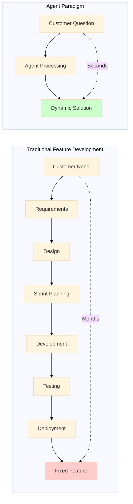
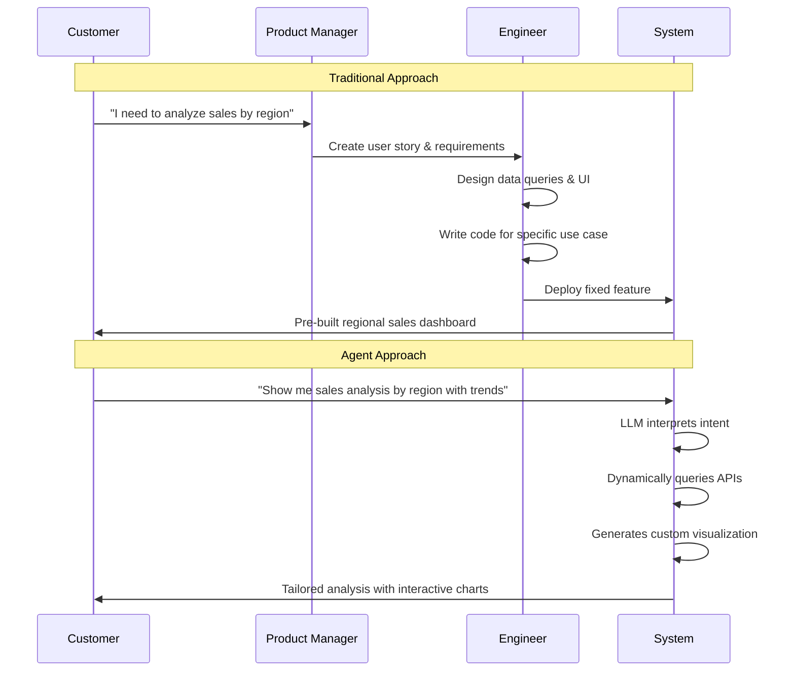
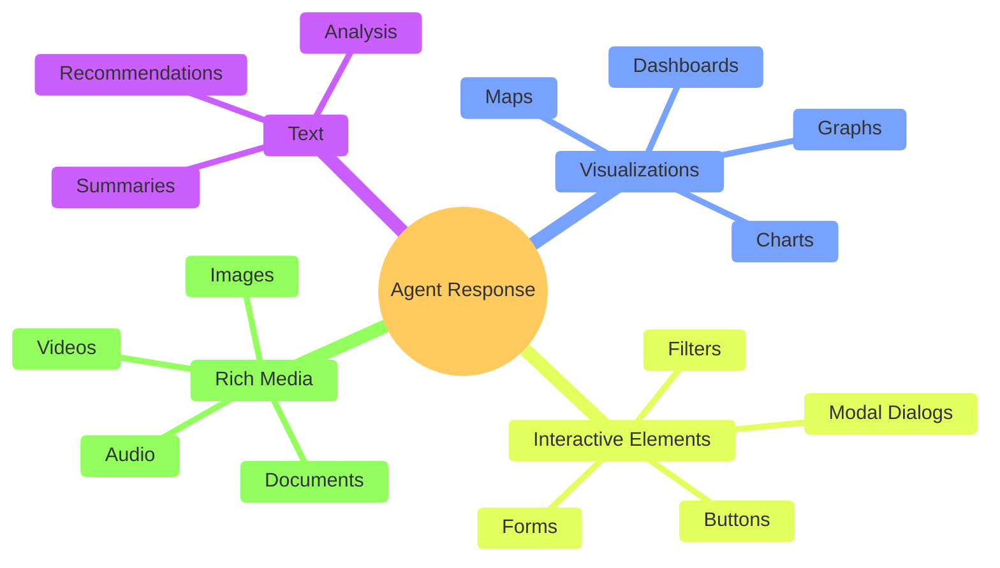
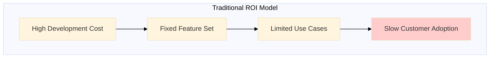
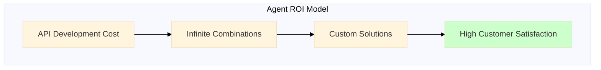

# Agents Flip the Feature Paradigm

[< Prev](./1.nothing-new-under-the-sun.md) | [Next >](./3.agent-basics.md)

## 🎯 **Presentation Summary**

### The Revolutionary Shift
> **From pre-built features to dynamically materialized solutions**

### Traditional vs Agent Paradigm

---

## ⚡ **Speed Comparison**

| Traditional Development | Agent Response |
|------------------------|----------------|
| 🗓️ **Months** to deliver | ⚡ **Seconds** to respond |
| 📋 Fixed set of features | 🎨 Infinite combinations |
| 👨‍💻 Engineer interprets need | 🤖 AI understands directly |
| 🏗️ Hardcoded solutions | 🔄 Dynamic orchestration |

---

## 🔄 **The Feature Lifecycle Revolution**

---

## 🎨 **Output Possibilities**

---

## 🏢 **Organizational Impact**

### What Changes for Engineers?
- **From**: Building specific features
- **To**: Creating reusable capabilities

### What Changes for Product?
- **From**: Predicting user needs
- **To**: Enabling user exploration

### What Changes for Customers?
- **From**: Learning your interface
- **To**: Expressing their intent

---

## 📊 **The Business Case**

---

# 📚 **Detailed Analysis**

## The Fundamental Paradigm Shift

The traditional software development paradigm operates on a predict-and-build model. Organizations invest significant time and resources trying to anticipate customer needs, translate those needs into technical requirements, and then build predetermined solutions. This approach assumes we can predict what customers will want and how they will want to use it.

Agents completely invert this model. Instead of predicting needs, we enable customers to express their needs directly in natural language. Instead of building predetermined features, we create dynamic capabilities that can be composed in real-time to meet the specific need in the moment.

## The Traditional Feature Development Cycle

### The Linear Process
1. **Customer Need Identification**: Often indirect through support tickets, surveys, or sales feedback
2. **Requirements Analysis**: Product managers interpret and translate needs into technical specifications
3. **Design Phase**: Architects and engineers design solutions within existing system constraints
4. **Development**: Engineers write code to implement the specific feature as designed
5. **Testing**: QA validates the implementation against predetermined requirements
6. **Deployment**: The fixed feature is released to production
7. **Adoption**: Customers learn to use the new feature within its constraints

### The Hidden Costs
- **Time to Market**: Typically 3-6 months from need identification to deployment
- **Opportunity Cost**: Customer needs evolve while features are in development
- **Maintenance Burden**: Each feature adds to technical debt and maintenance overhead
- **Rigidity**: Fixed implementations can't adapt to variations in customer needs
- **Prediction Risk**: Features may not match actual usage patterns

## The Agent Paradigm

### Immediate Response Model
1. **Direct Expression**: Customer states their need in natural language
2. **AI Interpretation**: LLM understands intent and context
3. **Dynamic Orchestration**: Agent selects and combines appropriate APIs and data sources
4. **Custom Generation**: Response is crafted specifically for this request
5. **Rich Output**: Can include text, visualizations, interactive elements, or entire UIs

### The Transformation Benefits
- **Speed**: Responses in seconds rather than months
- **Customization**: Every interaction produces a bespoke solution
- **Flexibility**: Same underlying capabilities can serve unlimited use cases
- **Learning**: Each interaction provides data on actual customer needs
- **Scalability**: One agent can serve diverse needs across multiple domains

## Rich Response Capabilities

Modern LLMs can generate far more than text responses. Agent systems can produce:

### Visual Outputs
- Dynamic charts and graphs tailored to specific data requests
- Interactive dashboards with real-time filtering and drill-down capabilities
- Geographic visualizations and heat maps
- Process diagrams and flowcharts

### Interactive Elements
- Custom forms for data input and validation
- Modal dialogs for complex workflows
- Clickable buttons that trigger additional agent actions
- Progressive disclosure interfaces that adapt to user exploration

### Complete Applications
- Single-page applications generated for specific use cases
- Embedded widgets that can be integrated into existing systems
- Mobile-responsive interfaces optimized for the user's device
- Accessibility-compliant interfaces that meet diverse user needs

## Engineering Implications

### Role Evolution
Engineers transition from feature implementers to capability creators. Instead of building specific solutions for predetermined use cases, they focus on:

- **API Design**: Creating well-designed, composable services
- **Data Architecture**: Ensuring data is accessible and queryable
- **Agent Configuration**: Defining how AI should orchestrate available capabilities
- **Quality Assurance**: Monitoring agent behavior and improving underlying services

### Technical Architecture
The agent paradigm requires a different technical foundation:

- **Service Orientation**: All functionality must be accessible via APIs
- **Data Accessibility**: Information must be queryable and combinable
- **Monitoring**: Understanding how agents use services to optimize performance
- **Security**: Ensuring agents operate within appropriate boundaries

## Business Model Transformation

### From Product to Platform
Organizations shift from building products to creating platforms that enable unlimited product variations. The value proposition changes from "we built what you need" to "we enable what you need when you need it."

### Customer Relationship Changes
- **Discovery**: Customers explore capabilities through conversation rather than documentation
- **Adoption**: No learning curve for new features—just ask for what you want
- **Support**: Issues are often resolved through conversation rather than tickets
- **Feedback**: Real-time understanding of customer needs through actual requests

### Competitive Advantages
- **API Ecosystem**: The breadth and quality of available services becomes the differentiator
- **Data Assets**: Rich, accessible data creates more valuable agent responses
- **Domain Expertise**: Agents trained on industry-specific knowledge provide better orchestration
- **Integration Capabilities**: Ability to connect disparate systems through agent orchestration

## Future Implications

The agent paradigm suggests a future where the concept of "features" becomes obsolete. Instead of discrete functionality, organizations provide capabilities that can be infinitely combined and recombined based on user intent.

This shift has profound implications for product strategy, engineering organization, customer success, and competitive positioning. Organizations that master this transition will be able to serve customer needs with unprecedented speed and precision, while those that remain in the traditional paradigm may find themselves increasingly unable to compete on responsiveness and customization.

The question for engineering leaders is not whether this shift will happen, but how quickly they can transform their organizations to capitalize on this new paradigm while it's still a competitive advantage rather than table stakes.