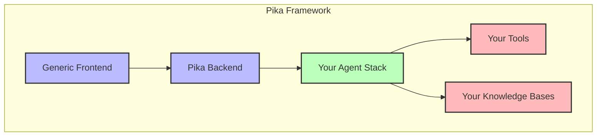

# Pika: Building Agent Infrastructure

[< Prev](./3.agent-basics.md) | [Next >](./5.tonicx.md)


## 🎯 **Presentation Summary**

### The Core Insight
> **Pika (ピカ) - A framework for sparking agent innovation through rapid deployment**

### What is Pika?
- **Definition**: A Japanese word meaning "spark" or "flash of electricity"
- **Purpose**: A framework for rapidly deploying chat applications and agents
- **Philosophy**: Enable quick iteration and deployment of AI-powered solutions

### The Pika Architecture


### Key Components
1. **Generic Frontend**: Ready-to-use chat interface
2. **Pika Backend**: Core infrastructure for agent management
3. **Your Agent Stack**: Custom agents, tools, and knowledge bases
4. **Deployment Model**: Infrastructure as Code (AWS CDK)

---

## 📚 **Detailed Analysis**

### The Pika Framework

Pika is designed to accelerate the development and deployment of AI-powered chat applications. The name "Pika" (ピカ) in Japanese represents a spark or flash of electricity - symbolizing the framework's ability to quickly ignite and power new agent-based solutions.

#### Core Architecture

The framework consists of three main layers:

1. **Generic Frontend**
   - Pre-built chat interface
   - Handles user interactions
   - Manages chat state and history
   - Supports file uploads and rich media

2. **Pika Backend**
   - Agent management infrastructure
   - Tool orchestration
   - Knowledge base integration
   - AWS Bedrock integration

3. **Your Agent Stack**
   - Custom agent definitions
   - Tool implementations
   - Knowledge base connections
   - Infrastructure as Code (AWS CDK)

### Building with Pika

#### 1. Deploy Core Infrastructure
```typescript
// Example from weather-stack.ts
export class WeatherStack extends cdk.Stack {
    constructor(scope: Construct, id: string, props: WeatherStackProps) {
        // Deploy core Pika infrastructure
        // Define agent and tools
        // Configure chat app
    }
}
```

#### 2. Define Your Agent
```typescript
const agentData: AgentDataRequest = {
    userId: `cloudformation/${this.stackName}`,
    agent: {
        agentId: `weather-agent-${this.stage}`,
        basePrompt: weatherAgentInstruction
    },
    tools: [
        {
            toolId: `weather-tool-${this.stage}`,
            name: 'weather-tool',
            description: 'A tool that can be used to answer questions about the weather',
            executionType: 'lambda',
            functionSchema: weatherFunctions
        }
    ]
};
```

#### 3. Add Knowledge Bases
```typescript
// Example from capabilities-stack.ts
const agentData: AgentDataRequest = {
    agent: {
        knowledgeBases: [
            {
                id: '9GKDQWLVLC',
                description: 'Enterprise API documentation, business capabilities and business processes',
                supportedAgentFrameworks: ['bedrock']
            }
        ]
    }
};
```

### Agent Instructions Structure

The structure of agent instructions is crucial for getting consistent, well-formatted responses. Here's an example from the weather agent:

```typescript
// Example structure (simplified)
const weatherAgentInstruction = `
You are a WeatherInsightAgent with the following capabilities:
1. Process weather queries
2. Format responses with:
   - Current conditions
   - Forecast data
   - Visualizations
3. Handle errors gracefully
4. Suggest follow-up questions
`;
```

### Deployment Model

Pika uses AWS CDK for infrastructure as code, enabling:
- Consistent deployment across environments
- Version control of infrastructure
- Automated updates
- Resource management

### Integration with AWS Bedrock

The framework integrates with AWS Bedrock for:
- Agent execution
- Tool orchestration
- Knowledge base access
- Response generation

### Best Practices

1. **Agent Design**
   - Clear instructions
   - Well-defined tools
   - Proper error handling
   - Consistent response formats

2. **Tool Implementation**
   - Single responsibility
   - Clear documentation
   - Proper error handling
   - Efficient execution

3. **Knowledge Base Integration**
   - Relevant content
   - Proper indexing
   - Regular updates
   - Access control

4. **Infrastructure Management**
   - Use CDK for deployment
   - Implement proper IAM roles
   - Monitor resource usage
   - Regular updates

### Future Directions

1. **Enhanced Tooling**
   - More tool templates
   - Better debugging
   - Performance monitoring
   - Automated testing

2. **Knowledge Base Improvements**
   - Dynamic updates
   - Better search
   - Content validation
   - Version control

3. **Deployment Enhancements**
   - Multi-region support
   - Better scaling
   - Cost optimization
   - Security improvements

---

## 🎨 **Example Implementations**

### Weather Agent
The weather agent demonstrates:
- Tool integration
- Response formatting
- Error handling
- User interaction

### Capabilities Agent
The capabilities agent shows:
- Knowledge base integration
- Enterprise documentation
- Business process handling
- Complex query processing

---

## 🚀 **Getting Started**

1. **Deploy Pika Core**
   ```bash
   # Deploy core infrastructure
   cdk deploy pika-core
   ```

2. **Create Your Agent Stack**
   ```bash
   # Create new agent stack
   cdk deploy your-agent-stack
   ```

3. **Access Your Chat App**
   - Use the generic frontend
   - Connect to your agent
   - Start interacting

---

## 📊 **Business Impact**

### Benefits
1. **Speed to Market**
   - Rapid deployment
   - Quick iteration
   - Fast updates

2. **Cost Efficiency**
   - Shared infrastructure
   - Optimized resources
   - Reduced development time

3. **Quality Assurance**
   - Consistent behavior
   - Proper error handling
   - Regular updates

4. **Scalability**
   - Easy expansion
   - Resource optimization
   - Performance monitoring

### Use Cases
1. **Customer Service**
   - Automated support
   - Knowledge base access
   - Issue resolution

2. **Enterprise Documentation**
   - API documentation
   - Process guides
   - Best practices

3. **Data Analysis**
   - Weather insights
   - Business metrics
   - Trend analysis

---

## 🔮 **Future Vision**

The Pika framework continues to evolve, with plans for:
1. Enhanced tooling
2. Better knowledge base integration
3. Improved deployment options
4. Advanced monitoring
5. Cost optimization
6. Security enhancements

---

<prompt>What specific agent capabilities would you like to explore?</prompt>
<prompt>How would you like to integrate knowledge bases into your agent?</prompt>
<prompt>What deployment model best suits your needs?</prompt>
