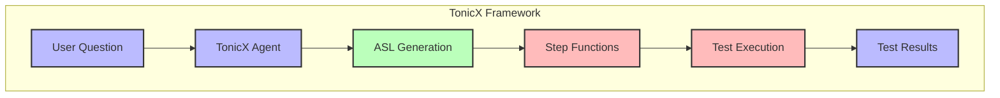

# TonicX: AI-Powered Integration Testing

[< Prev](./4.agents-pika.md)

## 🎯 **Presentation Summary**

TonicX is a sister open source project that uses Pika.

### The Core Insight
> **TonicX - Turning natural language into executable integration tests through AI orchestration**

### What is TonicX?
- **Definition**: A tonic is something that improves or strengthens - in this case, improving our testing capabilities with the "X" representing the innovative leap forward
- **Purpose**: A framework for generating and executing integration tests from natural language
- **Philosophy**: Make integration testing as natural as having a conversation

### The TonicX Architecture


### Key Components
1. **Natural Language Interface**: User-friendly test specification
2. **TonicX Agent**: AI-powered test generation
3. **ASL Generator**: AWS Step Functions definition creator
4. **Test Executor**: Automated test runner
5. **Results Analyzer**: Test outcome interpreter

---

## 📚 **Detailed Analysis**

### The TonicX Framework

TonicX is designed to revolutionize integration testing by making it as natural as having a conversation. The name "TonicX" (トニックX) combines:
- **Tonic**: A stimulant that invigorates and strengthens (like how tests strengthen our systems)
- **X**: Represents the innovative, cross-functional nature of the solution

#### Core Architecture

The framework consists of four main layers:

1. **Natural Language Interface**
   - Conversational test specification
   - Context-aware test generation
   - Interactive test refinement
   - Rich test documentation

2. **TonicX Agent**
   - Test intent understanding
   - ASL generation
   - Test orchestration
   - Result interpretation

3. **ASL Generator**
   - AWS Step Functions definition
   - State machine creation
   - Error handling
   - Test flow optimization

4. **Test Executor**
   - Automated test running
   - Result collection
   - Failure analysis
   - Test reporting

### Building with TonicX

#### 1. Define Test Intent
```typescript
// Example test specification
const testIntent = `
Verify that when a user submits an order:
1. The order is validated
2. Payment is processed
3. Inventory is updated
4. Confirmation is sent
`;
```

#### 2. Generate ASL
```typescript
// Example ASL generation
const aslDefinition = {
    "Comment": "Order processing integration test",
    "StartAt": "ValidateOrder",
    "States": {
        "ValidateOrder": {
            "Type": "Task",
            "Resource": "arn:aws:lambda:region:account:function:validate-order",
            "Next": "ProcessPayment"
        },
        // ... other states
    }
};
```

#### 3. Execute Test
```typescript
// Example test execution
const testResult = await tonicX.execute({
    testId: "order-processing-test",
    aslDefinition: aslDefinition,
    environment: "staging"
});
```

### Test Generation Process

1. **Intent Understanding**
   - Parse natural language
   - Identify test components
   - Map to system capabilities
   - Generate test structure

2. **ASL Creation**
   - Define state machine
   - Configure error handling
   - Set up retry logic
   - Optimize test flow

3. **Test Execution**
   - Deploy test definition
   - Monitor execution
   - Collect results
   - Analyze outcomes

### Integration with AWS Step Functions

TonicX leverages AWS Step Functions for:
- Test orchestration
- State management
- Error handling
- Execution tracking

### Best Practices

1. **Test Design**
   - Clear test intent
   - Comprehensive coverage
   - Proper error handling
   - Maintainable structure

2. **ASL Generation**
   - Efficient state machines
   - Proper error handling
   - Clear documentation
   - Optimized execution

3. **Test Execution**
   - Environment isolation
   - Result validation
   - Failure analysis
   - Performance monitoring

4. **Maintenance**
   - Regular updates
   - Version control
   - Documentation
   - Test optimization

### Future Directions

1. **Enhanced Generation**
   - More test patterns
   - Better intent understanding
   - Automated optimization
   - Cross-service testing

2. **Execution Improvements**
   - Parallel testing
   - Better monitoring
   - Faster execution
   - Cost optimization

3. **Integration Enhancements**
   - More service support
   - Better error handling
   - Advanced reporting
   - CI/CD integration

---

## 🎨 **Example Implementations**

### Order Processing Test
Demonstrates:
- Complex workflow testing
- Error handling
- State management
- Result validation

### Payment Integration Test
Shows:
- Cross-service testing
- Transaction handling
- Rollback scenarios
- Performance testing

---

## 🚀 **Getting Started**

1. **Deploy TonicX**
   ```bash
   # Deploy core infrastructure
   cdk deploy tonicx-core
   ```

2. **Create Your First Test**
   ```bash
   # Generate test from natural language
   tonicx generate "Test user registration flow"
   ```

3. **Execute Tests**
   ```bash
   # Run generated tests
   tonicx execute --test-id "user-registration-test"
   ```

---

## 📊 **Business Impact**

### Benefits
1. **Development Speed**
   - Rapid test creation
   - Quick iteration
   - Fast feedback

2. **Quality Assurance**
   - Comprehensive coverage
   - Automated execution
   - Consistent results

3. **Cost Efficiency**
   - Reduced test development time
   - Automated maintenance
   - Optimized execution

4. **Team Productivity**
   - Natural language testing
   - Reduced learning curve
   - Better collaboration

### Use Cases
1. **Integration Testing**
   - Service workflows
   - API testing
   - End-to-end scenarios

2. **Regression Testing**
   - Automated verification
   - Change impact analysis
   - Performance regression

3. **Continuous Testing**
   - CI/CD integration
   - Automated validation
   - Quality gates

---

## 🔮 **Future Vision**

TonicX continues to evolve, with plans for:
1. Advanced test generation
2. Better execution optimization
3. Enhanced reporting
4. Cross-service testing
5. Performance improvements
6. Security enhancements

---

<prompt>What specific integration test scenarios would you like to explore?</prompt>
<prompt>How would you like to integrate TonicX into your CI/CD pipeline?</prompt>
<prompt>What test patterns would be most valuable for your team?</prompt>
