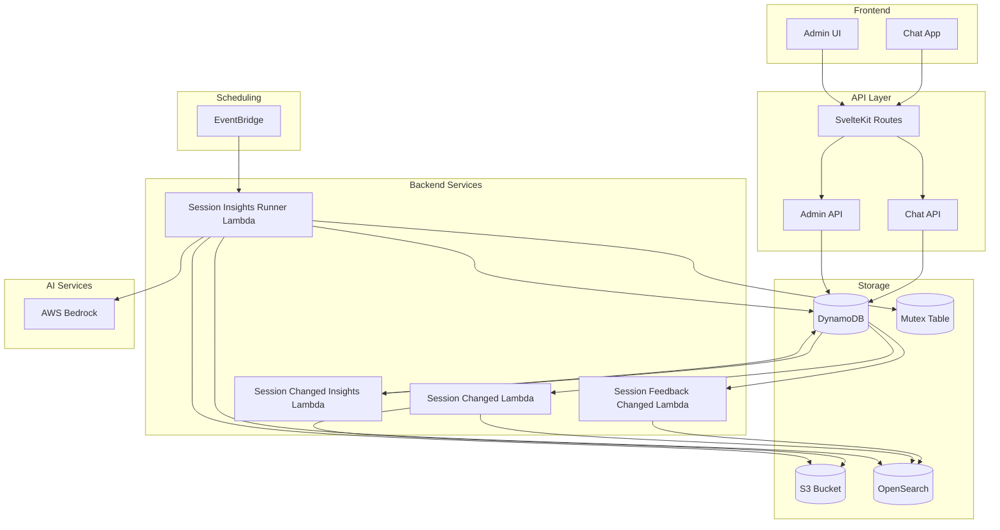
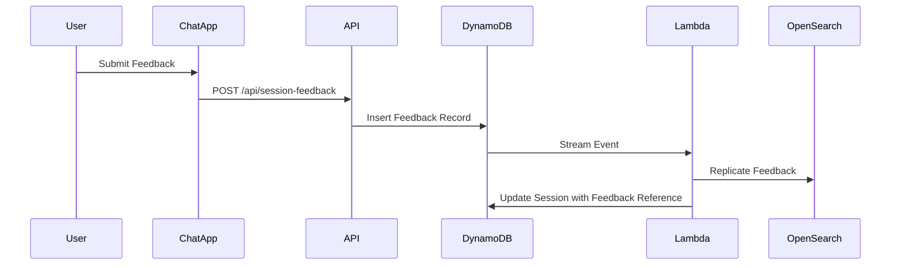
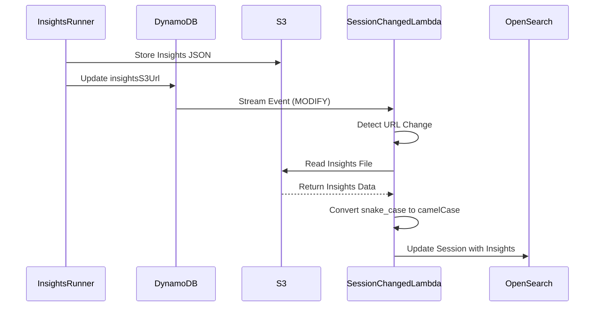
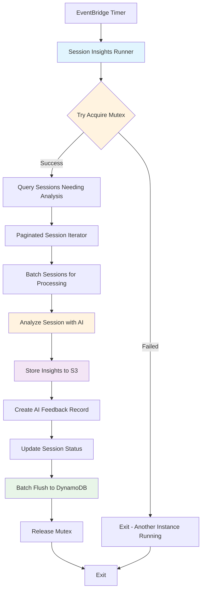

# Insights and Feedback Architecture

## Overview

The Pika platform provides two interconnected features for analyzing and improving chat interactions:

- **Feedback System**: Collects and manages user feedback on chat sessions
- **Insights System**: Generates AI-powered insights about chat sessions and automatically creates improvement feedback

Both features integrate with OpenSearch for advanced querying and analytics, enabling comprehensive session analysis and continuous improvement of the chat experience.

## System Architecture



## Feedback System Architecture

### Overview

The feedback system enables collection, storage, and analysis of user feedback on chat sessions. It supports both manual user feedback and automated AI-generated feedback.

### Components

#### 1. Data Storage

- **Primary Storage**: `chat-session-feedback` DynamoDB table
- **Secondary Storage**: OpenSearch for advanced querying and analytics
- **Schema**: Feedback records linked to sessions with timestamps and metadata

#### 2. API Endpoints

- **Chat API**: `POST /api/chat/feedback`, `GET /api/chat/feedback/{sessionId}`
- **Admin API**: `POST /api/chat-admin/session/feedback`, `PUT /api/chat-admin/session/feedback`
- **SvelteKit Routes**: `/api/session-feedback/`, `/api/session-feedback/[sessionId]/`

#### 3. Stream Processing

- **Lambda**: `session-feedback-changed`
- **Trigger**: DynamoDB Streams on feedback table
- **Function**: Replicates feedback data to OpenSearch for analytics

### Data Flow



### Feedback Types

- **Manual User Feedback**: Direct user input on session quality
- **AI-Generated Feedback**: Automated feedback from insights analysis
- **Admin Feedback**: Manual feedback from administrators

## OpenSearch Synchronization Architecture

### Overview

The OpenSearch synchronization system ensures that session data in the search index remains consistent with both DynamoDB session records and S3-stored insights files. This enables comprehensive analytics and search capabilities across all session data.

### Components

#### Session Changed Lambda

- **File**: `src/lambda/session-changed/index.ts`
- **Trigger**: DynamoDB Streams on chat session table
- **Function**: Replicates session changes to OpenSearch with intelligent insights handling
- **Key Features**:
    - Monitors `insightsS3Url` changes in session records
    - Automatically reads insights from S3 when URLs are added or modified
    - Removes insights from OpenSearch when URLs are cleared
    - Preserves existing insights when no URL changes occur

#### Insights Synchronization Logic

The lambda implements sophisticated logic to handle different insights URL change scenarios:

```typescript
// Case 1: No URL changes - preserve existing insights
if (newInsightsUrl === oldInsightsUrl) {
    return newSession; // Don't overwrite OpenSearch insights
}

// Case 2: URL removed - clear insights from OpenSearch
if (oldInsightsUrl && !newInsightsUrl) {
    return { ...newSession, insights: undefined };
}

// Case 3: URL added/changed - read from S3 and populate
if (newInsightsUrl) {
    const insights = await readInsightsFromS3(newInsightsUrl);
    return { ...newSession, insights };
}
```

### Data Flow



### S3 Integration

#### URL Parsing

```typescript
function parseS3Url(s3Url: string): { bucket: string; key: string } | null {
    // Parses s3://bucket-name/path/to/file.json format
    // Returns structured bucket and key for GetObject operation
}
```

#### Insights Retrieval

```typescript
async function readInsightsFromS3(s3Url: string): Promise<SessionInsights | undefined> {
    // 1. Parse S3 URL to extract bucket and key
    // 2. Execute GetObjectCommand to read insights file
    // 3. Convert JSON from snake_case (storage) to camelCase (application)
    // 4. Return formatted insights for OpenSearch indexing
}
```

### Insights Embedding Process

When session insights are generated, they are automatically embedded into OpenSearch:

```typescript
// 1. Insights runner saves to S3 and updates session with insightsS3Url
await s3Client.send(
    new PutObjectCommand({
        Bucket: process.env.PIKA_S3_BUCKET,
        Key: `session-insights/${chatAppId}/${userId}/${messageId}.json`,
        Body: JSON.stringify(sessionInsights)
    })
);

// 2. Session-changed lambda detects the S3 URL change
const newInsightsUrl = newSession.insightsS3Url;
const oldInsightsUrl = oldSession?.insightsS3Url;

// 3. Reads insights from S3 and embeds in session object
if (newInsightsUrl) {
    const insights = await readInsightsFromS3(newInsightsUrl);
    return { ...newSession, insights };
}

// 4. Syncs session with embedded insights to OpenSearch
await chatSessionUpdated({ updatedObjects: [sessionWithInsights] });
```

### OpenSearch Session Document Structure

```typescript
interface ChatSessionOs {
    session_id: string;
    user_id: string;
    chat_app_id: string;
    title: string;
    last_message_id: string;
    insights_s3_url?: string;
    insights?: SessionInsights; // Embedded insights data
    feedback: ChatSessionFeedback[]; // Array of feedback records
    // ... other session fields
}
```

### Benefits

- **Automatic Sync**: Insights appear in OpenSearch immediately when generated
- **Data Consistency**: Search index always reflects current S3 storage state
- **Format Translation**: Seamless conversion between storage and application formats
- **Error Resilience**: Graceful handling of S3 read failures with detailed logging
- **Memory Efficiency**: Only reads S3 when insights URLs actually change
- **Embedded Data**: Insights are directly searchable within session documents

## Insights System Architecture

### Overview

The insights system uses AI to analyze chat sessions and generate actionable insights about conversation quality, user satisfaction, and improvement opportunities.

### Components

#### 1. Continuous Processing Pipeline

- **Architecture**: Hybrid streaming-batch pipeline with atomic session completion
- **Scheduling**: EventBridge-based continuous execution every minute with mutex coordination
- **Processing**: Parallel processing with controlled concurrency and timeout management
- **Coordination**: DynamoDB mutex table prevents multiple concurrent executions

#### 2. Core Lambda Functions

##### Session Insights Runner

- **File**: `src/lambda/session-insights-runner/index.ts`
- **Trigger**: EventBridge rule (every minute)
- **Function**: Main processing daemon that analyzes sessions requiring insights
- **Key Features**:
    - DynamoDB mutex-based coordination to ensure single instance execution
    - Hybrid pipeline with atomic session completion
    - Memory-efficient frequent batch flushing
    - Graceful timeout handling with 20% buffer
    - Configurable concurrency limits for Bedrock API calls
    - Automatic lock release with 20-minute TTL for failover

##### Session Changed Insights Trigger

- **File**: `src/lambda/session-changed-insights/index.ts`
- **Trigger**: DynamoDB Streams on chat session table
- **Function**: Marks sessions as needing insights analysis when messages change
- **Logic**:
    - **Rule 1**: Session has `lastMessageId` but no `lastAnalyzedMessageId` → Set `insightStatus = 'NEEDS_INSIGHTS_ANALYSIS'`
    - **Rule 2**: Session has both but `lastMessageId ≠ lastAnalyzedMessageId` → Clear `lastAnalyzedMessageId` and set `insightStatus = 'NEEDS_INSIGHTS_ANALYSIS'`
    - **Rule 3**: Session has both and `lastMessageId = lastAnalyzedMessageId` → No action needed
    - **Additional Rule**: Session has no `lastMessageId` but has `insightStatus` set → Clear the status

#### 3. AI Analysis Engine

- **File**: `src/lambda/session-insights-runner/insights-analyzer.ts`
- **AI Provider**: AWS Bedrock (Claude models)
- **Default Model**: `us.anthropic.claude-3-5-sonnet-20241022-v2:0`
- **Fast Model**: `anthropic.claude-3-haiku-20240307-v1:0`
- **Instructions File**: `analyze-session-instructions-v2.md` (versioned)
- **Analysis Areas**:
    - User goals and goal completion status
    - User sentiment and satisfaction level
    - AI confidence levels during interaction
    - Session complexity assessment
    - Critical issues requiring escalation
    - Areas for improvement and suggestions
    - Feature requests and enhancement opportunities
    - Urgency assessment and required follow-up actions

#### 4. Storage Strategy

- **Session Metadata**: DynamoDB with insight status tracking (`insightStatus`, `lastAnalyzedMessageId`, `insightsS3Url`)
- **Insights Files**: S3 at `session-insights/{chatAppId}/{userId}/{lastAnalyzedMessageId}.json`
- **Coordination**: DynamoDB mutex table (`session-runner-mutex`) for execution coordination
- **Feedback Records**: Auto-generated feedback stored in feedback system with specific types:
    - `critical_issues_present` (severity: critical)
    - `low_ai_confidence_level` (severity: medium)
    - `high_complexity_session` (severity: low)
    - `user_dissatisfied` (severity: high)
    - `goal_misalignment` (severity: high)
- **Search Index**: OpenSearch for advanced analytics with embedded insights data

### Processing Pipeline



### Hybrid Pipeline Configuration

```typescript
interface PipelineConfig {
    queryPageSize: 200; // DynamoDB pagination balance
    insightBatchSize: 10; // Parallel insights per page
    dbBatchSize: 12; // Frequent flush threshold
    insightConcurrency: 3; // Concurrent Bedrock calls
    feedbackConcurrency: 3; // Concurrent feedback writes
    timeoutBufferMs: number; // 20% of lambda timeout (calculated dynamically)
    maxRetries: 3; // Per operation retry limit
}
```

### Atomic Session Processing

The insights runner implements atomic session completion to ensure data consistency:

```typescript
// Each session is fully processed before moving to the next
await analyzeSession(session, sessionBatch, feedbackBatch);

// Automatic batch flushing when threshold is reached
if (sessionBatch.length >= config.dbBatchSize) {
    await flushPendingBatches(sessionBatch, feedbackBatch, config);
}
```

### Auto-Generated Feedback Logic

Based on AI analysis results, specific feedback types are automatically created:

```typescript
// Critical issues trigger immediate feedback
if (scoring.assessments.critical_issues_present || scoring.assessments.requires_followup || scoring.assessments.escalation_needed) {
    // Creates 'critical_issues_present' feedback with severity: 'critical'
}

// Low confidence triggers medium-priority feedback
if (scoring.metrics.ai_confidence_level == 'low') {
    // Creates 'low_ai_confidence_level' feedback with severity: 'medium'
}

// High complexity sessions flagged for training
if (scoring.metrics.complexity_level == 'high') {
    // Creates 'high_complexity_session' feedback with severity: 'low'
}
```

### Key Benefits

- **Atomic Completion**: Each session fully processed before moving to next
- **Memory Efficiency**: Frequent flushing prevents accumulation
- **Transactional Consistency**: Session updates and feedback creation happen together
- **Timeout Resilience**: Graceful shutdown with pending batch flushing
- **Cost Optimization**: Efficient DynamoDB batching while maintaining atomicity

## Data Models

### Session Feedback Record

```typescript
interface ChatSessionFeedback {
    feedbackId: string; // UUID v7 for time-ordered IDs
    sessionId: string;
    userId: string; // Can be actual user or 'ai-feedback-user'
    messageId: string; // Message this feedback relates to
    reportedByHuman: boolean; // false for AI-generated feedback
    createdByCustomer: boolean; // false for internal/AI feedback
    status: 'open' | 'closed';
    severity: 'low' | 'medium' | 'high' | 'critical';
    type: string; // e.g., 'critical_issues_present', 'user_dissatisfied'
    userComment: string; // Feedback content/description
    createdOn: string; // ISO timestamp
    updatedOn: string; // ISO timestamp
}
```

### Session Insights Metadata (DynamoDB)

```typescript
interface SessionInsightsMetadata {
    sessionId: string;
    insightStatus: 'NEEDS_INSIGHTS_ANALYSIS' | null; // null when completed
    lastAnalyzedMessageId?: string;
    insightsS3Url?: string; // s3://bucket/session-insights/chatAppId/userId/messageId.json
}
```

### Insights File Format (S3)

```typescript
interface SessionInsights {
    model: string; // AI model used (e.g., 'us.anthropic.claude-3-5-sonnet')
    version: string; // Insights format version (e.g., '2')
    usage: {
        input_tokens: number;
        output_tokens: number;
    };
    scoring: {
        assessments: {
            goal_completion_status: 'completed' | 'partially_completed' | 'not_completed';
            satisfaction_level: 'satisfied' | 'neutral' | 'dissatisfied';
            user_sentiment: 'positive' | 'neutral' | 'negative';
            critical_issues_present: boolean;
            requires_followup: boolean;
            escalation_needed: boolean;
        };
        metrics: {
            ai_confidence_level: 'high' | 'medium' | 'low';
            complexity_level: 'low' | 'medium' | 'high';
        };
    };
    detail_markdown: string; // Full AI analysis response
}
```

## Configuration

### Environment Variables

#### Insights Runner

```bash
WAIT_TO_COMPUTE_INSIGHTS_MS=3600000     # 1 hour settling time before analysis
NOOP_EXECUTION=false                    # Enable/disable processing (for testing)
SESSION_RUNNER_MUTEX_TABLE=<name>       # DynamoDB mutex table for coordination
PIKA_S3_BUCKET=<name>                  # S3 bucket for insights storage
CHAT_SESSION_TABLE=<name>              # DynamoDB session table
CHAT_SESSION_FEEDBACK_TABLE=<name>     # DynamoDB feedback table
PIKA_DOMAIN_ENDPOINT=<url>             # OpenSearch endpoint
AWS_REGION=<region>                    # AWS region for all services

# Insights analysis configuration
DEFAULT_MODEL=us.anthropic.claude-3-5-sonnet-20241022-v2:0
FAST_MODEL=anthropic.claude-3-haiku-20240307-v1:0
INSIGHTS_VERSION=2                     # Current insights format version
```

#### CDK Infrastructure

```typescript
// EventBridge Rule Configuration
schedule: events.Schedule.rate(cdk.Duration.minutes(1)); // Every minute
retryAttempts: 0; // Don't retry - let next schedule handle it

// DynamoDB Mutex Table Configuration
timeToLiveAttribute: 'ttl'; // Auto-cleanup stale locks after 20 minutes
billingMode: dynamodb.BillingMode.PAY_PER_REQUEST;

// Lambda Configuration
timeout: Duration.minutes(15);
memorySize: 1024; // Insights runner needs more memory

// Session Settling Period
const sessionSettleDurationMS = 1000 * 60 * 60; // 1 hour default wait
```

### Session Processing Rules

The insights system implements intelligent session processing rules:

1. **Settling Period**: Sessions must have no new messages for `WAIT_TO_COMPUTE_INSIGHTS_MS` (default: 1 hour) before analysis
2. **Cutoff Calculation**: `const cutoffDate = new Date(Date.now() - waitTime);`
3. **Timeout Management**: Reserves 20% of Lambda timeout as buffer: `Math.floor(context.getRemainingTimeInMillis() * 0.2)`
4. **Continuous Scheduling**: EventBridge triggers execution every minute automatically
5. **Mutex Coordination**: DynamoDB conditional writes ensure only one instance processes at a time
6. **Lock TTL**: Stale locks automatically expire after 20 minutes via DynamoDB TTL

## Security and Permissions

### IAM Policies

#### Insights Runner Lambda

- **Bedrock**: `InvokeModel`, `InvokeModelWithResponseStream`
- **DynamoDB**: Full CRUD on session and feedback tables, plus mutex table access
- **S3**: Read/write to `session-insights/*` prefix
- **OpenSearch**: Full access for indexing and search

#### Stream Processing Lambdas

- **DynamoDB**: Stream read permissions and table write access
- **OpenSearch**: Index write permissions for replication

#### Session Changed Lambda

- **DynamoDB**: Stream read permissions and staging table write access
- **S3**: Read access to `session-insights/*` for insights synchronization
- **OpenSearch**: Full index access for session and insights replication

### Data Privacy

- **PII Handling**: Insights analysis processes chat content but stores only analytical metadata
- **Access Control**: Role-based access through existing authentication system
- **Audit Trail**: All feedback and insights operations logged with timestamps

## Monitoring and Observability

### Key Metrics

- **Processing Rate**: Sessions analyzed per hour
- **Error Rate**: Failed insights analysis attempts
- **Latency**: Time from session completion to insights generation
- **Mutex Contention**: Frequency of concurrent execution attempts
- **Lock Duration**: Time locks are held during processing
- **Cost Tracking**: Bedrock API usage and S3 storage
- **Sync Latency**: Time from S3 insights storage to OpenSearch availability
- **S3 Read Operations**: Insights file retrieval frequency and success rate

### Alerts

- **High Mutex Contention**: Multiple instances competing for locks frequently
- **Stale Locks**: Locks reaching TTL expiration (indicates lambda failures)
- **Lambda Errors**: Insights runner failure rate above threshold
- **Bedrock Throttling**: AI API rate limit exceeded
- **S3 Read Failures**: Insights file retrieval errors above threshold
- **Sync Lag**: OpenSearch insights synchronization delays beyond SLA

## Deployment

### Prerequisites

- OpenSearch domain configured
- Session feedback table enabled
- S3 bucket with appropriate permissions
- Bedrock model access enabled

### CDK Deployment

```bash
# Deploy with insights feature enabled
cdk deploy -c stage=prod \
  --parameters sessionInsightsFeature=enabled
```

### Feature Flags

- `sessionInsightsFeature`: Controls insights system deployment
- `NOOP_EXECUTION`: Allows disabling processing without redeployment

## Operational Procedures

### Scaling Considerations

- **Bedrock Limits**: Monitor API quotas and request increases
- **DynamoDB Throughput**: Provision adequate capacity for batch writes
- **Lambda Concurrency**: Configure reserved concurrency for insights runner
- **S3 Lifecycle**: Implement policies for insights file retention

### Troubleshooting

- **No Processing**: Check EventBridge rule is enabled and triggering
- **High Contention**: Multiple lambdas attempting to acquire mutex - check scaling settings
- **Stuck Locks**: Monitor mutex table for stale locks - verify TTL is working
- **Missing Insights**: Verify session status and wait time configuration
- **OpenSearch Sync**: Monitor stream processing lambda for replication issues
- **Cost Optimization**: Tune batch sizes and concurrency limits
- **Insights Missing in Search**: Check session-changed lambda logs for S3 read errors
- **Stale Insights Data**: Verify insightsS3Url changes trigger OpenSearch updates
- **S3 Permission Errors**: Ensure session-changed lambda has read access to insights prefix

## Future Enhancements

### Planned Features

- **Real-time Insights**: Streaming analysis for immediate feedback
- **Custom Analysis Models**: Domain-specific insights templates
- **Batch Reprocessing**: Ability to regenerate insights for historical sessions
- **Advanced Analytics**: Machine learning on feedback patterns
- **Integration APIs**: Webhook support for external systems

### Performance Optimizations

- **Caching Layer**: Redis for frequently accessed insights
- **Parallel Processing**: Multi-queue architecture for high throughput
- **Smart Batching**: Dynamic batch sizing based on load
- **Predictive Scaling**: Auto-scaling based on usage patterns
