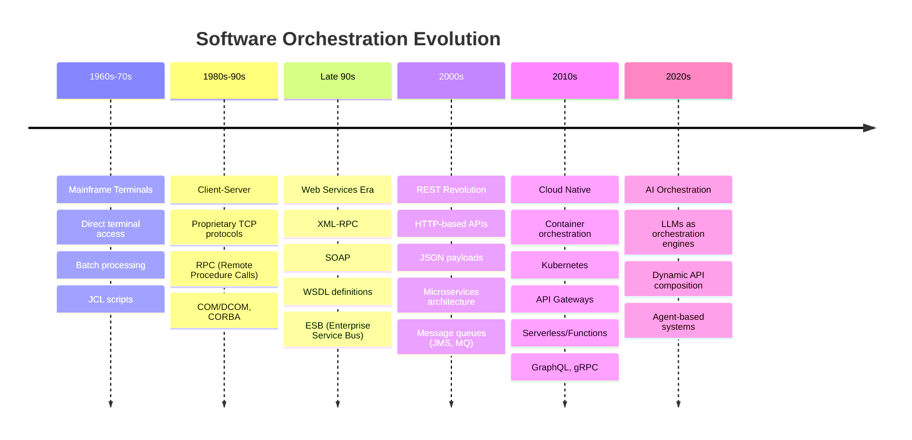
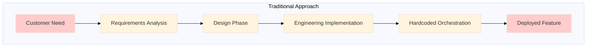
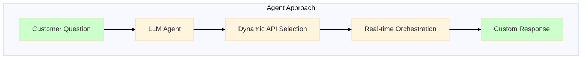
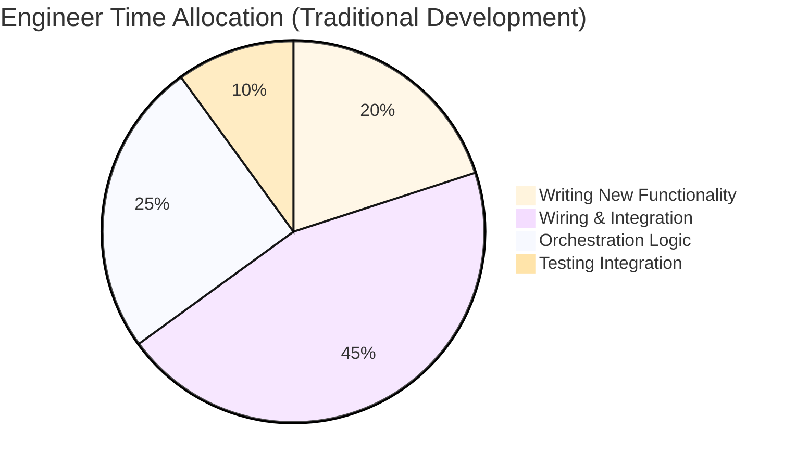

# Agents: Nothing New Under the Sun

[Next >](./2.agents-flip-the-paradigm.md)

## 🎯 **Presentation Summary**

### The Core Insight

> **Agents are just the latest evolution in software orchestration - with AI as the orchestration engine**

### The Pattern That Never Changes

```
New Functionality + Better Orchestration = Software Evolution
```

### What Makes Agents Different?

- **Before**: Engineers hardcode orchestration logic
- **Now**: LLMs orchestrate APIs dynamically based on user intent

---

## 📈 **The Evolution of Software Orchestration**



---

## 🔄 **From Static to Dynamic Orchestration**





---

## 🛠️ **What Engineers Actually Do**



**With Agents**: Engineers focus on defining capabilities, LLMs handle orchestration

---

## 🚀 **Why This Matters Now**

### The Agent Advantage

1. **Speed**: No development cycle for new use cases
2. **Flexibility**: One API set, infinite combinations
3. **User Empowerment**: Customers express needs directly
4. **Rich Responses**: Text, charts, widgets, entire UIs

### The Business Impact

- **Time to Value**: Minutes instead of months
- **Custom Solutions**: Every interaction is bespoke
- **Lower Maintenance**: Less hardcoded logic to maintain

---

# 📚 **Detailed Background**

## The Unchanging Pattern of Software Evolution

There truly is nothing new under the sun when it comes to software architecture. The fundamental pattern that has driven software evolution for decades remains unchanged: engineers spend their time writing small amounts of new functionality while investing the majority of their effort in finding better ways to wrap, expose, and orchestrate that functionality for future use cases.

## The Complete Evolution Timeline

### Mainframe Era (1960s-1970s)

The journey began with terminal access to mainframes, where orchestration meant batch processing through Job Control Language (JCL) scripts. Users submitted jobs that would orchestrate system resources according to predefined workflows.

### Client-Server Revolution (1980s-1990s)

The shift to client-server architectures introduced proprietary TCP protocols and Remote Procedure Calls (RPC). Technologies like COM/DCOM (Component Object Model) and CORBA (Common Object Request Broker Architecture) emerged as early attempts at distributed object orchestration, allowing applications to invoke services across network boundaries.

### Web Services Era (Late 1990s-Early 2000s)

The internet age brought XML-RPC and SOAP (Simple Object Access Protocol) with WSDL (Web Services Description Language) definitions. Enterprise Service Bus (ESB) architectures became the orchestration backbone, providing message routing, transformation, and protocol mediation across disparate systems.

### REST and Microservices (2000s-2010s)

The REST revolution simplified API design with HTTP-based services and JSON payloads. This era saw the rise of microservices architecture, supported by message queues (JMS, MQ), API gateways, and eventually container orchestration platforms like Kubernetes. GraphQL and gRPC provided more sophisticated ways to compose and optimize API interactions.

### Cloud Native Era (2010s-2020s)

Serverless computing and Functions-as-a-Service (FaaS) abstracted away infrastructure concerns, while sophisticated API gateways provided routing, authentication, and composition capabilities. Event-driven architectures enabled loose coupling and dynamic scaling.

### AI Orchestration Era (2020s-Present)

Today's agents represent the latest evolution: using Large Language Models as intelligent orchestration engines that can dynamically compose API calls, query databases, and synthesize responses based on natural language instructions.

## The Engineering Reality

Throughout this evolution, the core engineering challenge has remained constant. An engineer's time is predominantly spent on integration and orchestration rather than creating net-new functionality. Studies suggest that 70-80% of development effort goes toward connecting existing systems, handling data transformations, and implementing orchestration logic.

## Agents as Orchestration Engines

Modern agents flip this paradigm by using LLMs as dynamic orchestration engines. Given an initial set of instructions and access to APIs and databases, an LLM can determine which services to call, in what sequence, with what parameters, to fulfill a user's request. This isn't just about answering questions—LLMs can perform analysis, generate visualizations, and even create interactive user interfaces on demand.

## The Paradigm Shift

Traditional software development follows a linear path: identify customer need → analyze requirements → design solution → implement orchestration logic → deploy feature. This process can take months and results in rigid, predetermined functionality.

Agents enable a fundamentally different approach: customer expresses need → agent dynamically orchestrates available services → custom solution materialized instantly. The agent, equipped with understanding of available APIs and databases, crafts responses that can include rich visualizations, interactive widgets, and complete user interfaces.

## Future Implications

This evolution suggests a future where features materialize in the moment they are needed, rather than being pre-built and deployed. Organizations can respond to customer needs with unprecedented speed and customization, while engineers focus on creating reusable capabilities rather than predetermined orchestrations.

The implications extend beyond technical architecture to business models, customer experience, and organizational agility. In this new paradigm, the quality and comprehensiveness of your API ecosystem becomes your competitive advantage, while AI handles the complex task of composing these capabilities into customer value.
