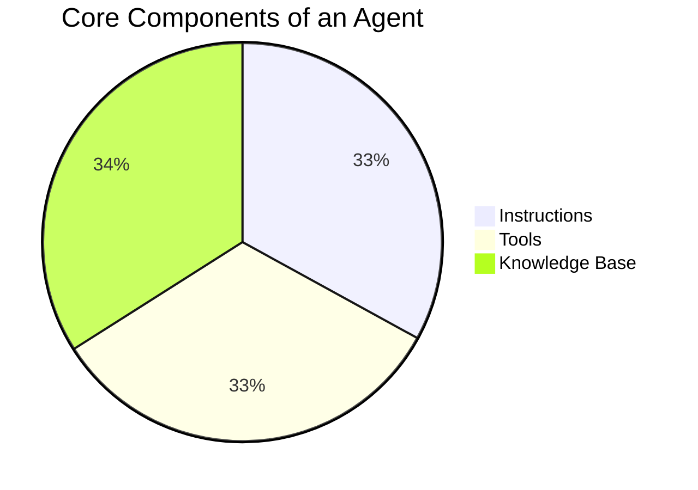
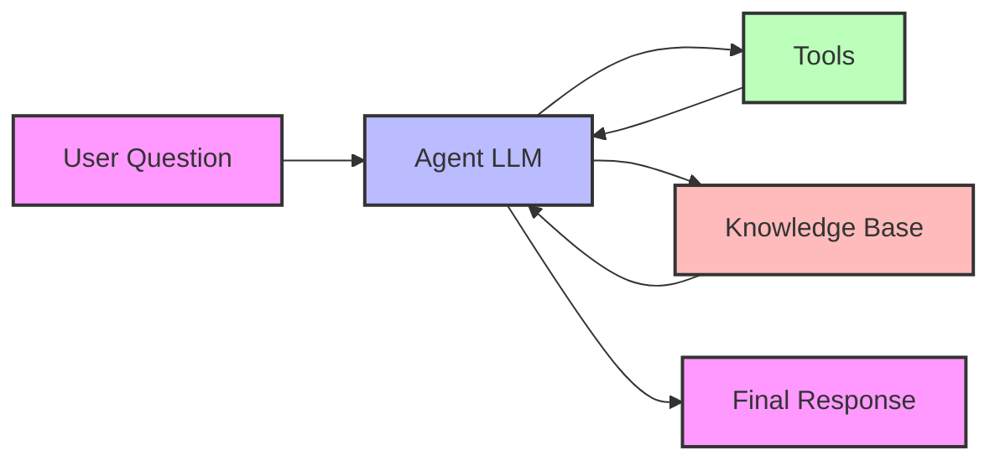

# Agent Basics

[< Prev](./2.agents-flip-the-paradigm.md) | [Next >](./4.agents-pika-and-tonicx.md)

## Understanding Agent Components

## Agent Workflow

## Core Components Explained

### 1. Instructions

Instructions are the foundational guidelines that define an agent's personality, capabilities, and behavior. They act as a constitution for the agent, determining how it should:

- Process and respond to user queries
- Format its responses
- Handle different types of data
- Present information visually
- Suggest follow-up questions

**Example from Weather Agent:**
The weather agent's instructions define it as a "WeatherInsightAgent" with specific directives for accuracy, user-centricity, and proactive assistance. It includes detailed formatting requirements for responses, including how to present charts, images, and follow-up prompts.

### 2. Tools

Tools are the agent's capabilities - functions it can call to perform specific tasks. Each tool has:

- A defined purpose
- Required parameters
- Expected return values
- Clear documentation

**Example from Weather Agent:**
The weather agent has tools like:

- `getWeatherForecast`: Retrieves weather predictions
- `getCurrentWeather`: Gets real-time conditions
- `getAirQuality`: Provides air quality data
- `getGeocoding`: Converts location names to coordinates

### 3. Knowledge Base

The knowledge base provides the agent with:

- Domain-specific information
- Historical data
- Reference materials
- Context for decision-making

While not explicitly shown in the weather agent example, knowledge bases are crucial for agents that need to:

- Access historical data
- Reference documentation
- Maintain context across conversations
- Provide accurate, up-to-date information

## How It All Works Together

1. **User Interaction**: A user asks a question (e.g., "What's the weather in San Francisco?")

2. **Agent Processing**:

    - The agent receives the question
    - Consults its instructions to understand how to handle it
    - Determines which tools might be needed
    - Checks its knowledge base for relevant context

3. **Tool Execution**:

    - The agent might use multiple tools in sequence
    - For weather queries, it might:
        1. Use `getGeocoding` to convert "San Francisco" to coordinates
        2. Call `getCurrentWeather` with those coordinates
        3. Use `getWeatherForecast` for future conditions

4. **Response Generation**:
    - Combines tool results with knowledge base information
    - Formats the response according to instructions
    - Includes appropriate visualizations
    - Suggests relevant follow-up questions

## Best Practices

1. **Clear Instructions**

    - Be specific about agent behavior
    - Define response formats
    - Include error handling guidelines

2. **Well-Defined Tools**

    - Keep tools focused and single-purpose
    - Document parameters clearly
    - Handle edge cases gracefully

3. **Comprehensive Knowledge Base**
    - Keep information up-to-date
    - Structure for easy access
    - Include relevant context

<prompt>What specific weather data would you like to explore?</prompt>
<prompt>How would you like to visualize the weather information?</prompt>
<prompt>Would you like to compare weather conditions across different locations?</prompt>
