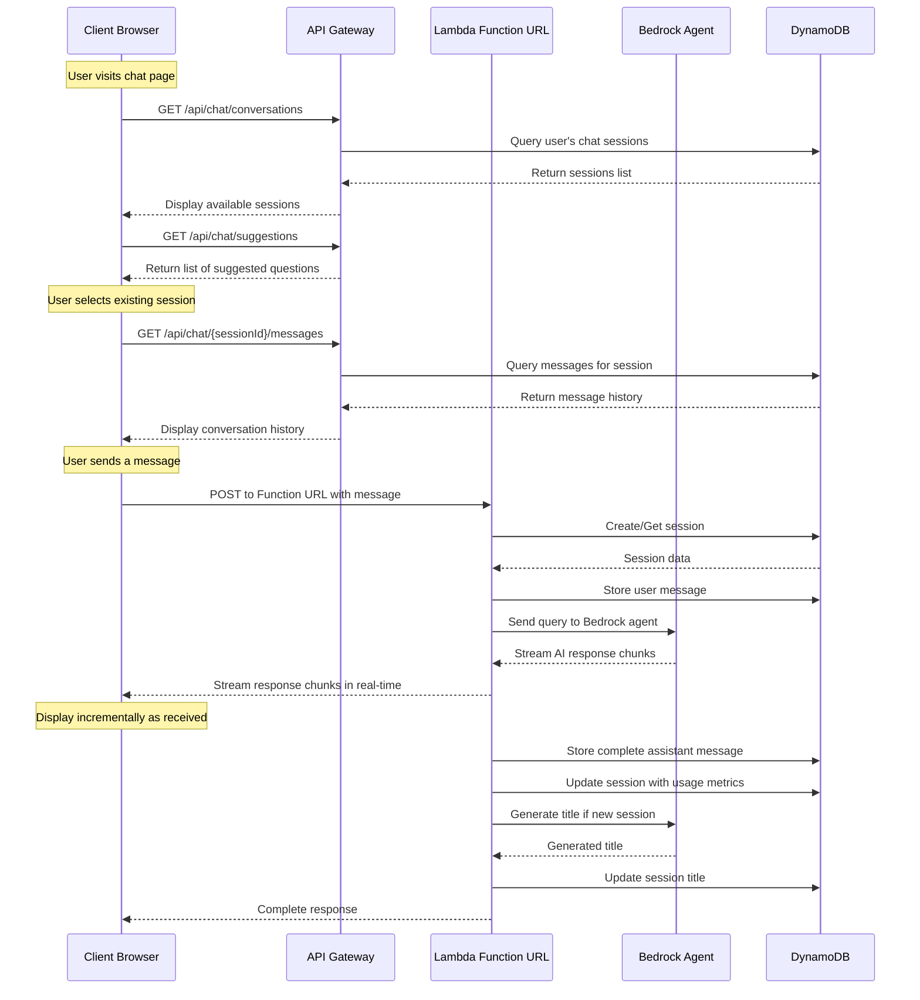
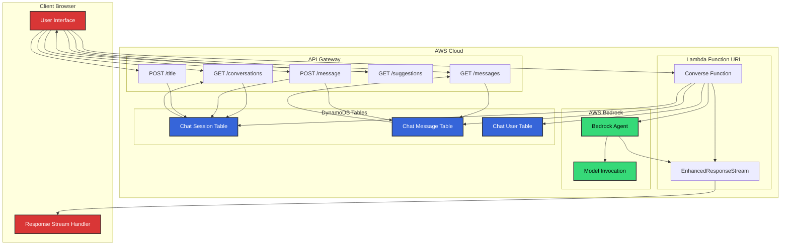

# Architecture

## Concepts

### Core

### ChatSession
A single conversation thread, typically created by a user, where each message in the conversation thread alternates by turns: the user asks a question, then it's the assistant's turn who responds, etc. A ChatSession contains metadata such as sessionId, userId, agentId, agentAliasId, identityId, title, and various tracking information like costs and token usage.

### ChatMessage
A message from either the user or the assistant within a chat session. Each message contains the content, source (user or assistant), timestamp, and when coming from the assistant, may include usage statistics, execution duration, and trace information from the underlying model.

### Turn
A complete interaction cycle consisting of a user message and the corresponding assistant response. Each turn represents one question-answer exchange in the conversation flow. The turn concept helps organize the back-and-forth nature of the conversation and is used to track the state and progression of the dialogue.

### Assistant
The LLM-based bedrock agent who answers questions from the user. In this system, it's implemented using AWS Bedrock with models like Anthropic Claude. The assistant processes user messages, generates responses, and can track various metrics about its performance.

### Technical

### EnhancedResponseStream
A specialized stream used to handle the real-time streaming of assistant responses back to the user. This allows for progressive rendering of responses as they're being generated instead of waiting for the complete answer.

### SessionAttributes
Additional metadata associated with a chat session, including information about the user (firstName, lastName), their company (companyId, companyType), and other context like timezone.

### ChatMessageUsage
Tracking information about token consumption and costs associated with each message. This includes inputTokens, outputTokens, inputCost, outputCost, and totalCost, providing transparency about resource utilization.

### ModelInvocation
The process of calling the underlying large language model (like Claude) through the Bedrock service. Each invocation includes input formatting, parameter settings, and processing of the response, along with collection of usage metrics.

## File Organization

### Project Structure

```
pika/
├── services/
│   └── chatbot/
│       ├── docs/                           # Documentation
│       ├── src/
│       │   ├── api/                        # API endpoints
│       │   │   ├── chatbot/
│       │   │   │   └── index.ts
│       │   │   └── suggestions/
│       │   │       └── index.ts
│       │   ├── lib/                        # Core library functions
│       │   │   ├── bedrock-agent.ts
│       │   │   ├── server-apis.ts
│       │   │   ├── chat-ddb.ts
│       │   │   ├── utils.ts
│       │   │   └── bedrock-types.ts
│       │   └── lambda/                     # Lambda functions
│       │       ├── converse/
│       │       │   └── EnhancedResponseStream.ts
│       │       ├── weather/
│       │       └── index.ts
│       └── lib/                            # Infrastructure
│           └── stacks/
│               └── chatbot-stack.ts
└── packages/
    └── shared/
        └── src/
            └── types/                      # Shared type definitions
                └── chatbot/
                    ├── chatbot-types.ts
                    └── bedrock.ts
```

### Key Files and Their Purpose

| File | Description |
|------|-------------|
| [**chatbot-stack.ts**](../lib/stacks/chatbot-stack.ts) | AWS CDK infrastructure stack defining tables, functions, API routes, and Bedrock configuration |
| [**chatbot-types.ts**](../../../packages/shared/src/types/chatbot/chatbot-types.ts) | Core type definitions used throughout the application |
| [**bedrock.ts**](../../../packages/shared/src/types/chatbot/bedrock.ts) | Type definitions for AWS Bedrock service integration |
| [**api/chatbot/index.ts**](../src/api/chatbot/index.ts) | API endpoints for chat messages, sessions, and title updates |
| [**api/suggestions/index.ts**](../src/api/suggestions/index.ts) | API for retrieving suggested questions for the chatbot |
| [**lib/bedrock-agent.ts**](../src/lib/bedrock-agent.ts) | Functions for interacting with AWS Bedrock agent |
| [**lib/server-apis.ts**](../src/lib/server-apis.ts) | Server-side API functions for chat data operations |
| [**lib/chat-ddb.ts**](../src/lib/chat-ddb.ts) | Database operations using DynamoDB |
| [**lib/utils.ts**](../src/lib/utils.ts) | Utility functions used throughout the application |
| [**lib/bedrock-types.ts**](../src/lib/bedrock-types.ts) | Types specific to Bedrock integration |
| [**lambda/converse/EnhancedResponseStream.ts**](../src/lambda/converse/EnhancedResponseStream.ts) | Streaming functionality for real-time responses |
| [**lambda/index.ts**](../src/lambda/index.ts) | Lambda function entry point for handling routes |
| [**lambda/weather/**](../src/lambda/weather) | Weather-related Lambda functions |

# Flow of Control

## Block Diagram

```
Client Browser
┌───────────────────────────────────────────────────────────┐
│                                                           │
│  ┌─────────────┐                   ┌─────────────────┐    │
│  │     UI      │◄───────────────►  │ Response Stream │    │
│  └──────┬──────┘                   └──────────┬──────┘    │
│         │                                     │           │
└─────────┼─────────────────────────────────────┼───────────┘
          │                                     ▲
          │   API Calls                         │
          ▼                                     │
┌───────────────────────────────────────────────┼───────────┐
│                   AWS Cloud                   │           │
│                                               │           │
│  ┌─────────────────────────────────────────┐  │           │
│  │             API Gateway                 │  │           │
│  │                                         │  │           │
│  │  ┌─────────┐ ┌────────┐ ┌────────────┐  │  │           │
│  │  │  GET    │ │  GET   │ │    POST    │  │  │           │
│  │  │sessions │ │messages│ │   message  │  │  │           │
│  │  └────┬────┘ └───┬────┘ └─────┬──────┘  │  │           │
│  └───────┼──────────┼────────────┼─────────┘  │           │
│          │          │            │            │           │
│          │          │            │            │           │
│          ▼          ▼            ▼            │           │
│  ┌───────────────────────────────────────┐    │           │
│  │             DynamoDB                  │    │           │
│  │                                       │    │           │
│  │  ┌─────────┐ ┌────────┐ ┌─────────┐   │    │           │
│  │  │ Session │ │Message │ │  User   │   │    │           │
│  │  │  Table  │ │ Table  │ │  Table  │   │    │           │
│  │  └─────────┘ └────────┘ └─────────┘   │    │           │
│  └───────┬───────────┬────────┬──────────┘    │           │
│          │           │        │               │           │
│          │           │        │               │           │
│  ┌───────▼───────────▼────────▼─────────┐     │           │
│  │        Lambda Function URL           │     │           │
│  │                                      │     │           │
│  │  ┌─────────────┐ ┌───────────────┐   │     │           │
│  │  │  Converse   │ │ EnhancedStream│   │     │           │
│  │  │  Function   ├─►    Handler    ├───┼─────┘           │
│  │  └──────┬──────┘ └───────────────┘   │                 │
│  └─────────┼────────────────────────────┘                 │
│            │                                              │
│            ▼                                              │
│  ┌─────────────────────────────────┐                      │
│  │         AWS Bedrock             │                      │
│  │                                 │                      │
│  │  ┌─────────┐    ┌───────────┐   │                      │
│  │  │ Bedrock │    │   Model   │   │                      │
│  │  │  Agent  │◄──►│Invocation │   │                      │
│  │  └─────────┘    └───────────┘   │                      │
│  └─────────────────────────────────┘                      │
│                                                           │
└───────────────────────────────────────────────────────────┘
```
## Main Interaction Flow


## Detailed Message Flow



